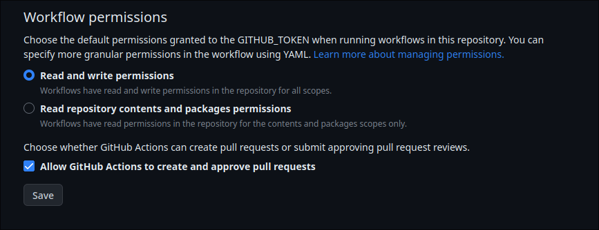

Following is my collection of lecture notes from the IISER Kolkata BSMS program. Some of the notes are in LaTeX, while others are handwritten. The notes are organized into different sections, each covering a specific topic.

